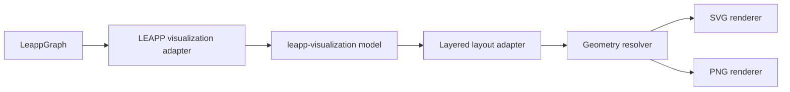

# Graph visualization auto-layout design

**Author:** Codex, for LEAPP maintainers
**Date:** 2026-06-26
**Status:** Draft

## Introduction

LEAPP currently emits a graph visualization when `leapp.compile_graph(visualize=True)` runs.
The visualization is useful for checking graph inputs, graph outputs, leapp nodes, feedback,
and data-flow wiring, but the implementation uses a NetworkX spring layout followed by an
interactive Matplotlib window where users manually drag nodes before saving the PNG. That is
not a good default for export workflows, CI, docs generation, or headless runs.

This design replaces the interactive Matplotlib visualization with a static, automatically
laid-out graph rendering. The new renderer emits both SVG and PNG and lives in the reusable
`leapp-visualization` sibling package. LEAPP keeps a small adapter that maps LEAPP nodes and
tensor descriptors into the generic visualization model. The renderer uses a layered layout
similar in spirit to rqt_graph and Netron, and it renders named tensor ports inside each
leapp node so users can inspect tensor names, shapes, dtypes, and semantic kinds directly in
the graph artifact.

## Research summary

The relevant reference tools use layered directed-graph layout, not force-directed layout:

- rqt_graph generates DOT with `rankdir='LR'` and delegates layout to `qt_dotgraph`, which
  uses pydot/pygraphviz and Graphviz `dot`.
- Netron uses a local Dagre-style implementation. It measures node and edge-label geometry,
  runs a layered layout in a worker, and then updates SVG nodes and paths.
- Graphviz `dot`, Dagre, and ELK are all Sugiyama-style layered layout families. This is a
  better fit for LEAPP than `nx.spring_layout` because LEAPP graphs are directed pipelines
  with meaningful flow direction.
- `fast-sugiyama` provides a uv-installable Python package backed by Rust, requires Python
  3.11+, has MIT licensing, and avoids a system Graphviz binary.

References:

- Netron: `source/worker.js`, `source/grapher.js`, `source/dagre.js`
  (`https://github.com/lutzroeder/netron`)
- rqt_graph: `src/rqt_graph/ros_graph.py`, `src/rqt_graph/dotcode.py`
  (`https://github.com/ros-visualization/rqt_graph`)
- qt_dotgraph: `qt_dotgraph/src/qt_dotgraph/*`
  (`https://github.com/ros-visualization/qt_gui_core`)
- Graphviz layout engines: `https://graphviz.org/docs/layouts/`
- fast-sugiyama: `https://pypi.org/project/fast-sugiyama/`

## Requirements

### Functional requirements

- `leapp.compile_graph(visualize=True)` emits:
  - `<graph_name>.svg`
  - `<graph_name>.png`
- The SVG is the primary artifact. The PNG is a raster companion generated from the same
  visual geometry.
- The renderer is static only. No embedded JavaScript, no hover behavior, and no browser
  runtime assumptions.
- The visualization shows:
  - graph inputs
  - leapp nodes
  - graph outputs
  - forward data-flow edges
  - feedback edges
- Each leapp node is rendered as a panel with visualization ports:
  - input ports on the left
  - output ports on the right
  - each port shows tensor name, shape, dtype, and kind when available
- Feedback edges are visually distinct and route around the main graph so the forward flow
  remains readable.
- The old interactive Matplotlib manual-layout path is removed.

### Non-functional requirements

- Dependencies must be installable by uv/pip and not require system Graphviz, Node, Java,
  Qt, or a browser.
- The feature may require Python 3.11+.
- Rendering must work in headless CI.
- Layout should be deterministic for stable docs and regression tests.
- The SVG should be readable in docs and browsers without external CSS/assets.
- The visual style should be modern and LEAPP-specific, not a raw NetworkX/Matplotlib plot.

### Out of scope

- Interactive graph exploration.
- Editing graph layouts by hand.
- Expanding inside ONNX/TorchScript/Warp artifacts to show operation-level internals.
- Persisting manual node positions.
- Perfect orthogonal edge routing for every graph shape.
- Replacing the YAML pipeline schema.

## Architecture



### Visualization model and LEAPP adapter

Add a small visual model separate from `LeappGraph` in the `leapp-visualization` package:

```python
@dataclass
class VisualGraph:
    nodes: list[VisualNode]
    terminals: list[VisualTerminal]
    edges: list[VisualEdge]

@dataclass
class VisualNode:
    id: str
    title: str
    inputs: list[VisualPort]
    outputs: list[VisualPort]
    backend: str | None

@dataclass
class VisualPort:
    id: str
    name: str
    shape: list[int | str]
    dtype: str
    kind: str | None
```

LEAPP's adapter consumes the in-memory `nodes`, `connections`, `feedback_connections`,
`graph_inputs`, and `graph_outputs` already passed to `visualize_graph()`. It does not parse
the generated YAML. It uses each node's `TensorDescription` data, including semantic fields
from `TensorDescription.dict()` / `get_semantics()`, and constructs a
`leapp_visualization.VisualGraph`.

### Layered layout adapter

Use `fast_sugiyama.from_edges()` to compute layer/order positions for the visible graph.
The layout graph includes leapp nodes plus graph input/output terminals so source and sink
positions participate in the same flow.

Feedback edges should not control the main rank assignment. The adapter lays out the forward
graph first, then routes feedback edges in the geometry resolver. This keeps feedback from
pulling later nodes leftward or creating confusing reversed layers.

For empty or edge-less visual graphs, the adapter uses a deterministic simple grid layout
instead of calling the Sugiyama solver.

### Geometry resolver

The resolver translates abstract layout coordinates into concrete SVG/PNG coordinates:

- Measure each leapp node from its title and port labels.
- Reserve a fixed row height per visualization port.
- Place input anchors on the left edge and output anchors on the right edge.
- Place graph input terminals to the left of their target ports.
- Place graph output terminals to the right of their source ports.
- Route forward edges as cubic Bezier paths from source port to target port.
- Route feedback edges around the outside margin with a distinct stroke and arrowhead.

Port label format:

```text
joint_pos
[1, 12] float32
state/joint/position
```

The kind line is omitted when absent. Long text is truncated for visual bounds; the SVG may
include a `<title>` element with the full label for accessibility even though the artifact is
otherwise static.

### SVG renderer

The SVG renderer emits a self-contained SVG string. It should not depend on an external SVG
library unless that proves materially simpler than using `xml.etree.ElementTree` or careful
string generation.

Visual direction:

- Quiet light background.
- Leapp node panels with a clear header and compact port rows.
- Backend/node-kind indicated by a small text badge or color strip.
- Graph inputs and outputs as compact terminals, not full cards.
- Forward edges in a neutral stroke.
- Feedback edges in a warm accent and routed around the graph boundary.
- No decorative gradients, blobs, or unrelated illustration.

Default visual tokens:

- Background: `#F7F8FA`
- Node panel: `#FFFFFF`
- Node border: `#C9D2DE`
- Header fill: `#EDF2F7`
- Primary text: `#18212F`
- Secondary text: `#5E6B7A`
- Forward edge: `#566273`
- Feedback edge: `#B42318`
- Graph input accent: `#2F855A`
- Graph output accent: `#C2410C`
- Torch backend accent: `#2563EB`
- Warp backend accent: `#76B900`
- Other/unknown backend accent: `#667085`

Typography should use a system sans stack in SVG:
`Inter, ui-sans-serif, system-ui, -apple-system, BlinkMacSystemFont, "Segoe UI", sans-serif`.
PNG rendering should use the closest available bundled/system font, with DejaVu Sans as the
expected Linux fallback. Font differences must not affect graph topology.

### PNG renderer

Use Pillow to render the same geometry directly to PNG. Do not convert SVG to PNG via
Graphviz, Cairo, browser automation, or any other system binary. This keeps PNG generation
inside uv/pip dependencies.

The PNG renderer can share the same colors, coordinates, text truncation, path control
points, and arrowhead math as the SVG renderer. Exact antialiasing will differ from browser
SVG rendering, but topology and placement should match.

## Dependency and packaging changes

- Raise `requires-python` to `>=3.11`.
- Add a default LEAPP dependency on the sibling `leapp-visualization` package.
- Put `fast-sugiyama>=0.5.3` in `leapp-visualization`.
- Put `Pillow>=10` or current project-preferred Pillow lower bound in `leapp-visualization`.
- Remove `matplotlib` if no other LEAPP runtime path needs it.
- Keep `networkx` if still useful for graph construction/tests, or remove it if the new
  visual model no longer needs NetworkX.

## Alternatives considered

### Graphviz `dot` via pydot/pygraphviz

Pros:

- Closest to rqt_graph.
- Mature and high-quality layered layout.

Cons:

- Requires a system Graphviz binary.
- Python wrappers alone are not enough for layout/rendering.
- Harder to keep installation uv-only.

Rejected because the design goal is pure uv/pip-installable dependencies.

### Dagre/ELK through JavaScript

Pros:

- Closest to Netron (Dagre) or more capable than Dagre (ELK).
- Strong support for directed graph visualization.

Cons:

- Adds a JS/Node/browser or bundling story to a Python export package.
- More moving parts for headless `compile_graph()`.

Rejected for packaging complexity.

### Grandalf or Netgraph

Pros:

- Python-accessible Sugiyama-style layout.
- No system Graphviz dependency.

Cons:

- Grandalf is GPLv2/EPL and relatively stale.
- Netgraph is GPLv3 and Matplotlib-based.
- Licensing and rendering direction are poor fits for an Apache-2.0 LEAPP package.

Rejected for license and fit.

### LEAPP-owned Sugiyama implementation

Pros:

- Maximum control.
- No compiled layout dependency.

Cons:

- More algorithm work.
- Higher risk of poor layouts and hidden graph edge cases.

Deferred. It remains a fallback option if `fast-sugiyama` is unsuitable.

## Risks and mitigations

| Risk | Impact | Likelihood | Mitigation |
|------|--------|------------|------------|
| `fast-sugiyama` does not understand port geometry | Medium | High | Use it only for node layer/order; compute ports and edges in LEAPP. |
| Feedback edges disturb forward flow | High | Medium | Exclude feedback edges from ranking and route them separately. |
| PNG output diverges from SVG | Medium | Medium | Render from one geometry model and add image smoke tests. |
| Long labels make nodes unreadable | Medium | High | Truncate visible text, keep full text in SVG `<title>`, use deterministic max widths. |
| Python 3.11 requirement affects users | Medium | Medium | Make the requirement explicit in package metadata and release notes. |
| Large graphs become visually dense | Medium | Medium | Keep compact terminals, deterministic spacing, and future room for subgraph collapsing. |

## Testing strategy

- Unit-test visual model construction from small synthetic LEAPP graphs:
  - single node
  - two-node chain
  - fork/join graph
  - graph inputs and graph outputs
  - feedback edge
  - semantic `kind` present and absent
- Unit-test geometry:
  - ports are on the expected side of their node
  - graph inputs are left of target nodes
  - graph outputs are right of source nodes
  - feedback paths stay outside the main bounding box
- Snapshot-test SVG structurally:
  - contains expected node ids, port labels, shape/dtype/kind text
  - contains arrow marker definitions
  - does not contain JavaScript
- PNG smoke test:
  - file exists
  - image opens with Pillow
  - dimensions are non-zero
  - selected non-background pixels exist
- Functional test `leapp.compile_graph(visualize=True)` emits both files.

## V1 decisions

- Docs should refer to SVG as the primary graph visualization artifact and PNG as the
  companion raster artifact.
- `compile_graph(visualize=True)` always emits both SVG and PNG in v1. No visualization
  format option is added yet.
- The visual style ships with the token set above. Future theming is out of scope.
